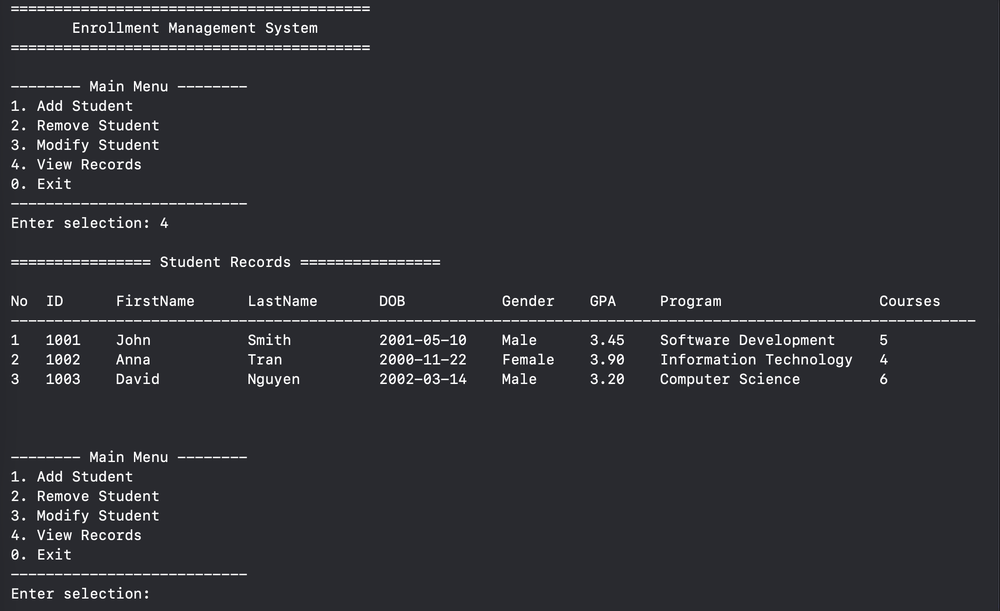

# Enrollment Management System -- Part 2

## Overview

This program is a simple **Enrollment Management System**. It allows to
manage student records.

The program can:

-   Add a student
-   Remove a student
-   Modify student information
-   View all student records
-   Exit the program

The program is written in **C#** and follows the pseudocode from Part 1.

Program UI 

------------------------------------------------------------------------

# Student Information

Each student record contains: 
- Student ID 
- First Name 
- Last Name 
- Date of Birth 
- Gender 
- Previous GPA 
- Current Semester 
- Program 
- Number of Courses

------------------------------------------------------------------------

# Variables

Examples:

``` csharp
int studentId;
string firstName;
double previousGPA;
```

``` csharp
List<Student> studentList;
```

------------------------------------------------------------------------

# Data Types

The program uses both **primitive** and **non-primitive data types**.

### Primitive Data Types

-   `string` for names and text
-   `int` for numbers such as student ID and semester
-   `double` for GPA values

Example:

``` csharp
int studentId;
double previousGPA;
```

### Non-Primitive Data Types

-   **List type** to store multiple students
-   **Class type** to represent a student record

Example:

``` csharp
public class Student
{
    public int StudentId { get; set; }
    public string FirstName { get; set; } = "";
    public string LastName { get; set; } = "";
    public string Gender { get; set; } = "";
    public string ProgramName { get; set; } = "";
    public int CurrentSemester { get; set; }
    public int NoOfCourses { get; set; }
    public string Dob { get; set; } = "";
    public double Gpa { get; set; }
}
```

------------------------------------------------------------------------

# Data Binding

This program uses both **static binding** and **dynamic data
structures**.

### Static Binding

Example:

``` csharp
int studentId;
double previousGPA;
```

Each variable has a fixed type. For example, `studentId` can only store
integer values.

------------------------------------------------------------------------

### Dynamic Data Structure

Example:

``` csharp
List<Student> studentList = new();
```

This list can change size during program execution. When a new student
is added, the list grows. When a student is removed, the list becomes
smaller.

------------------------------------------------------------------------

# Scoping

Variables have different scopes depending on where they are declared.

Example:

``` csharp
private void AddStudent()
{
    string firstName = InputHelper.ReadString("First name: ");
}
```

The variable `firstName` exists only inside the `AddStudent()` function.

------------------------------------------------------------------------

# Referencing

The program uses both **value types** and **reference types**. In C#, a
**class** is a reference type, while types such as `int` and `double`
are value types.

### Value Type

``` csharp
int studentId;
double previousGPA;
```

When a value type is assigned or passed to a function, a copy of the
data is created.

------------------------------------------------------------------------

### Reference Type

``` csharp
class Student
class EnrollmentController
```

When a class object is assigned to another variable, both variables
refer to the same object in memory.

# Subprograms

The program is divided into smaller subprograms.

Examples:

``` csharp
AddStudent()
RemoveStudent()
ModifyStudent()
DisplayStudents()
```

Each function performs a specific task in the system.

------------------------------------------------------------------------

# Conditional Statements

The program uses conditional statements for decision making.

Examples used in the program:

``` csharp
if
switch
```

Example:

``` csharp
switch (selection)
{
    case 1:
        AddStudent();
        break;
    case 2:
        RemoveStudent();
        break;
}
```

------------------------------------------------------------------------

# Loops

Loops are used to repeat operations.

Example:

``` csharp
while (running)
{
    ConsoleView.DisplayMenu();
}
```

Loops are also used to display student records.

``` csharp
for (int i = 0; i < students.Count; i++)
{
    Console.WriteLine(students[i].TableRow(i + 1));
}
```

------------------------------------------------------------------------
